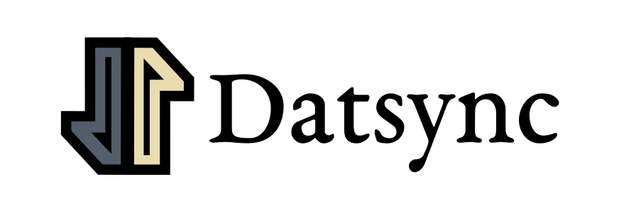

Datomic &lt;-> DataScript syncing/replication utilities

[](https://gitter.im/metasoarous/datsync?utm_source=badge&utm_medium=badge&utm_campaign=pr-badge&utm_content=badge)


## Introduction

This library offers tools for building DataScript databases as materialized views (very much in the re-frame/samsa sense) of some master/central Datomic database.
Eventually we hope to also provide helpers for handling optimistic updates, offline availability, scoped syncing, and security filters.
The current set of features:

* Translate ids between Datomic and DataScript in transaction flow
* Update DataScript schema based on transaction data from Datomic (shared schema, consequently)

This library is also part of the [Datsys architecture](https://github.com/metasoarous/datspec).
As such, it offers a set of ready-made system components (a la Stuart Sierra) for plugging into a componentized system (client only right now; server coming soon).
For a look at how Datsync hooks up in this fashion see the Datsys README.

For more general information about Datsys and Datsync:

* Clojure/West 2016 talk: [Datalog all the way down](https://www.youtube.com/watch?v=aI0zVzzoK_E)
* If you'd like to chat, see the [Datsys chatroom](https://gitter.im/metasoarous/datsys) and the [Datsync chatroom](https://gitter.im/metasoarous/datsync)
* For more in depth documentation (including the [big picture system vision](http://github.com/metasoarous/datsync/wiki/The-Vision) and this library's [current limitations and future directions](http://github.com/metasoarous/datsync/wiki/Current-limitations-and-future-directions)), see the [datsync GitHub wiki](https://github.com/metasoarous/datsync/wiki).
* For an API walkthrough, read on.
* The source is also heavily documented (though there's need for some cleanup).


## Quickstart

The easiest way to get Datsync running is to clone [Datsys](https://github.com/metasoarous/datsys).
It's a pretty minimal template, so it shouldn't be difficult to adapt it to your needs.

But for the sake of thoroughness, we'll cover here how you'd set things up.
First, add the following to your `project.clj`:

```
[datsync "0.0.1-alpha2-SNAPSHOT"]
```


### On the client (with system components)

Datsync includes some optional system components for setting things up on the client side.
You don't have to use these, if you'd rather just piece together the utility functions yourself.
If you do, you can use the implementation and design of these components as guidance in your own setup/architecture.
(There's also a small example below of how you'd set things up using Mount below).

Assuming you do want to use the component setup, Datsync provides:

* `dat.sync.client/Datsync`: Runs all sync processes, given a `:dispatcher` and a `:remote`
* `dat.remote.impl.sente/SenteRemote`: A valid `:remote` dependency of the `Datsync` component above.

Additionally, you'll need to pass the `:remote` and the `:dispatcher` components along to a `:reactor` component that actually reduces over the DataScript conn.
A `:reactor` implementation is available in [datreactor](https://github.com/metasoarous/datreactor) as `dat.reactor/SimpleReactor`.
The Datreactor project also has a couple of `:dispatcher` implementations, in particular `dat.reactor.dispatcher/StrictlyOrderedDispatcher`.

Here's what all this looks like put together with the standard component constructors:

```clj
(ns your-app
  (:require [dat.sync.client]
            [dat.remote]
            [dat.remote.impl.sente :as sente-remote]
            [datascript.core :as d]
            [dat.reactor.dispatcher :as dispatcher]))

(def conn (d/create-conn dat.sync.client/base-schema))

(defn new-system []
  (-> (component/system-map
        ;;          ;; A sente remote implementation handles client/server comms
        :remote     (sente-remote/new-sente-remote)
        ;;          :: Dispatcher accepts messages from wherever (pluggable event streams?) and presents them to the reactor
        :dispatcher (dispatcher/new-strictly-ordered-dispatcher)
        ;;          ;; The reactor is what orchestrates the event processing and handles side effects
        :reactor    (component/using
                      ;; the reactor needs an :app attribute which points to the DataScript :conn
                      (reactor/new-simple-reactor {:app {:conn conn}})
                      [:remote :dispatcher])
        ;;          ;; The Datsync component pipes data from the remote in to the reactor for processing, and registers
        ;;          ;; default handlers on the reactor for this data
        :datsync    (component/using
                      (dat.sync.client/new-datsync)
                      [:remote :dispatcher]))))
```

You may also specify `:app` in this system as a system component.
This is how [Datview](https://github.com/metasoarous/datview) works.
If you're using Datview, we recommend you look at the Datsys project for how that's set up.
And even if you're not, you may want to take a look at how it handles routes, history, etc.

Because all of these pieces are designed and build around protocols and specs, the semantics of how you'd
swap-out/customize system components are described in Datspec's [`dat.spec.protocol` namespace](https://github.com/metasoarous/datspec/blob/master/src/dat/spec/protocols.cljc).
That's also the best place to go for understanding the Datsys architectural vision.

#### What's going on here?

Behind the scenes, Datsync hooks things up so that messages coming from the server with event id `:dat.sync.client/recv-remote-tx` get transacted into our local database subject to the following conditions:

* Nested maps are expanded, so inner maps aren't just treated as single values in the DataScript db (thinking of
  revising this; should maybe just require that nested maps satisfy `:db/isComponent true`).
* Every entity gets a `:datsync.remote.db/id` mapping to the Datomic id
* Local ids try to match remote ids when possible
* A `:dat.sync.client/bootstrap` message is sent to the server to initiate the initial data payload from the server
* Any entity specified in the transaction which has a `:db/ident` attribute will be treated as part of the
  schema for the local `conn`'s db, and `assoc`'d into the db's `:schema` in a DataScript compatible manner
    * Any `:db/valueType` other than `:db.type/ref` will be removed, since DataScript errors on anything other
      than `:db.type/ref`
    * This operation updates the db indices by creating a new database with the new schema, and moving all the
      datoms over into it.
    * Schema entities are included as datoms in the db, not just as `:schema`
        * Keep in mind that idents aren't supported in DataScript, so to look up attribute entities, use attribute references
        * This can facilitate really powerful UI patterns based on schema metadata which direct the composition
          of UI components (in an overrideable fashion); have some WIP on this I might put in another lib eventually
    * We can also apply schema changes to an existing database using the `dat.sync.client/update-schema!` function, or by
      dispatching a `:dat.sync.client/apply-schema-changes` event.

Additionally, there is a `:dat.sync.client/send-remote-tx` event handler that takes transactions from the client and submits them to the server.
This function:

* Translates eids via `dat.sync.client/datomic-tx`
* Send a message to server over the remote as `[:dat.sync.remote/tx translated-tx]`

Handlers for the following messages are also set up:

* `[:dat.sync.client/apply-schema-changes schema-tx]` - Applies schema transaction to DataScript db conn
* `[:dat.sync.client/merge-schema schema-map]` - Merges the schema-map (DataScript style) into the DataScript db conn
* `[:dat.sync.client/bootstrap tx-data]` - Takes a bootstrap response and more or less delegates to `:dat.sync.client/recv-remote-tx`
* `[:dat.sync.client/request-bootstrap _]` - Initiates a remote request for the boostrap message (this is triggered automatically when the Datsync component fires up; you'll have to handle this on server)

### On the client (without system component)

If you're not into component, you can also set things manually using the helper functions defined in Datsync.

First create your database connection, and load it with some datsync specific schema:

```clj
(def conn (d/create-conn dat.sync.remote/base-schema))
```

While there are no restrictions presently as to what methods you may use for sending messages between client
and server, we'll show you roughly how you'd set things up manually using [Sente](https://github.com/ptaoussanis/sente).

#### Getting data into the client db

You'll need the client to receive data from the server as transactions.

Using `event-msg-handler` multimethod dispatching on message id (first element of the message vector, by default), we can intercept
messages with an id of (e.g.) `:dat.sync.client/recv-remote-tx`, and handle it as follows:

```clj
(def sente (sente/make-channel-socket ...))

(defmethod event-msg-handler first)

(defmethod event-msg-handler :dat.sync.client/recv-remote-tx
  [[_ tx-data]]
  (dat.sync/apply-remote-tx! conn tx-data))
  
;; Add whatever other methods to the handler you like
  
(sente/start-chsk-router (:ch-recv sente) event-msg-handler)
```

The `dat.sync.client/apply-remote-tx!` function takes your DataScript `conn` and a collection of transaction forms
(should be compatible with any Datomic transaction form), and applies that to the `conn`.
This function takes care of translating eids between Datomic and DataScript, and updates the DataScript schema when transactions are recieved for anything with a `:db/ident` attribute
(should maybe make this based on the install attribute, like in Datomic, but for now...).

You'll probably also want to kick off your own bootstrap process with a message sent to the server to trigger the initial data payload.
This might look something like:

```clj
(let [{:keys [send-fn]} sente]
  (send-fn [:dat.sync.client/request-bootstrap true]))
```

The server side handler then only has to return the corresponding `:dat.sync.client/recv-remote-tx` message in order to complete the cycle.

#### Sending transactions to the server

When we send transactions to the server, we need to translate their entity ids to the corresponding `:dat.sync.remote.db/id` values.
The `dat.sync.client/datomic-tx` utility function does this for us.
In sente you could write a little function that wraps this as follows.

```clj
(defn send-tx! [tx]
  (let [{:keys [send-fn]} sente]
    (send-fn [:dat.sync.client/tx (dat.sync.client/datomic-tx conn tx)])))
```

#### Schema API

There are additionally two functions presented for directly manipulating the database schema

* `(dat.sync.client/apply-schema-tx! conn schema-tx)` - Apply a schema transaction in Datomic's tx-form to the DataScript database
* `(dat.sync.client/update-schema! conn schema-spec)` - Merge a DataScript style schema map with the existing schema map

Note that at least the latter of these will probably be deprecated once a sufficiently clean solution is [added to DataScript](https://github.com/tonsky/datascript/issues/174)
The solution as presented does not yet do any validation, so be careful not to abuse them.
However, note that since messages coming from the remote are assumed to have been passed through Datomic, in the case of our `:dat.sync.client/recv-remote-tx` handler, we don't have to worry about this quite as much.

#### Using mount

You prefer mount to Stuart Sierra's vision of system components?
No problem!
You can simply call the `component/Lifecycle` `start` and `stop` method inside of your mount `:start` and `:stop` specs, as follows:

```clj
(defstate datsys
  :start (let [datsys (new-sytem)]
          (component/start datsys))
  :stop (component/stop @datsys))
```

Or if you'd rather, you can break up each of the individual Stuart Sierra components into their own mounts:

```clj
(defstate datremote
  :start (component/start (sente-remote/new-sente-remote))
  :stop (component/stop @datremote))
  
(defstate dispatcher
  ;; ...
  )
  
;; ...

(defstate datsync
  :start (component/start (dat.sync.client/new-datsync {:remote @datremote :dispatcher @dispatcher))
  :stop (component/stop @datsync))
```

This is a nice thing about the data-driven nature of Stuart Sierra's vision.
While it is less convenient in practice to have to pass around your system components everywhere,
designing around data makes it easy to plug these things into a mount setup.
By contrast, it would be much more cumbersome to try and wrap mount components into a Sierra-style system, hence, we argue the latter is a better target for libs.

Go ahead, eat your cake.


### On the server

Here things look pretty similar; we need to send and receive transactions.
However, as far as implementation goes, things are much simpler, since a lot of the translational work between DataScript and Datomic is set up to happen on the client side.

Eventually we'll add server-side system component protocols, specs and default implementations, so that this is all much more modular (as on the client).
But for now, we'll leave you with a quick demonstration of how you'd set things up with Sente.
(Though again, we'd recommend just cloning [Datsys](https://github.com/metasoarous/datsys) and tweaking from there, even if you don't want the rest of Datsys)

To start, let's require the `dat.sync.server` namespace and get sente set up:

```clj
(require '[dat.sync.server])

;; Set up sente
(def sente (sente/make-channel-socket-server! ...))

(def send! (:send-fn sente))

(defn broadcast! [event]
  (doseq [uids (:any @(:connected-uids @ws-connection))]
    (send! uid event))))
    
```

#### Receiving transactions

Next we need to handle `:dat.sync.client/tx` messages sent from the client.
If you're using regular http requests, you can just call this in your handler functions as you might normally handle a form submission and send a response indicating whether the transaction went through.
In sente, you might set this up as follows:

```clj
(defmethod event-msg-handler :id)

(defmethod event-msg-handler :dat.sync.remote/tx
  [{:as ev-msg :keys [?data]}]
  (dat.sync.server/apply-remote-tx! datomic-conn ?data))

(defn get-bootstrap []
  (concat
    ;; At least one of these should probably be for your schema, and we'll probably give you a helper for that
    (d/q ...)
    (d/q ...)))

(defmethod event-msg-handler :dat.sync.client/bootstrap
  [{:keys [uid]}]
  (send! uid [:dat.sync.client/bootstrap (get-bootstrap)]))

(sente/start-chsk-router (:ch-recv sente) event-msg-handler)
```


#### Sending transactions to clients

Every time we get a transaction, we want to send the results of that transaction to any client that needs to be notified.
Eventually we can get fancy with installing subscription middleware, so for each client we have a specification of what they have "checked out", but this is just a starting point.

Assuming we just send all changes to all clients using sente, you might write a function like this as a handler:

```clj
(defn handle-transaction-report! [tx-deltas]
  (broadcast! [:dat.sync.client/recv-remote-tx tx-deltas]))
```

This handler function should take a collection `tx-deltas` of `:db/add` and `:db/retract` tx forms which will automatically get computed from the datoms created in the transaction.
This handler function is also where you could implement your own scope restriction functionality and read authorization security protocols if needed.

We apply this handler function using the `dat.sync/start-transaction-listener!` function:

```clj
(dat.sync/start-transaction-listener! (d/tx-report-queue datomic-conn) handle-transaction-report!)
```

This function currently takes the Java blocking queue returned by `d/tx-report-queue` and consumes all changes placed on that queue.
We'll eventually make it possible to pass in a `core.async` channel as well, so you can pull messages off Datomic's single `tx-report-queue` and mult them out to various processes that needed these notifications as well.


## Contributing

This project is developed in a "gitflow" methodology.
Submit PRs to the `develop` branch.
Releases will be merged to master and tagged with version numbers.


## Alpha Disclaimer

This API is not yet stable.
In particular, anything not explicitly mentioned in this document (or one of the other datsys documents) should be considered an implementation detail, and is not to be relied upon.
Additionally, as we deal with issues around scoping, security filters, offline availability and decentralized sync, the API may need to adjust to meet the demands.
So until the path is clear there, we may yet change some of what has been described here, if it's in the best interest of the overall direction of the library and system.
However, we'll do the best we can to avoid where possible.

## License

Copyright © 2016 Christopher Small

Distributed under the Eclipse Public License either version 1.0 or (at your option) any later version.

